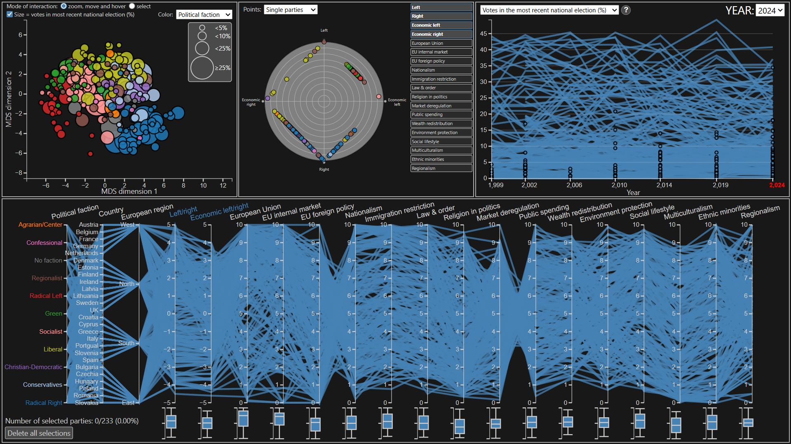

# European Parties Explorer - A Visual Analytics system for European politics
European Parties Explorer is my master thesis project for the Engineering in Computer Science course at La Sapienza University of Rome, developed with the **D3.js** library; it is a Visual Analytics application designed for studying the evolution of European politics starting from the year 1999, and for discovering interesting political insights and statistics about national parties from European countries.

More information on this project can be found in my [master thesis](documents/thesis.pdf) and [presentation slides](documents/slides.pdf).

## Link to the application
You can use European Parties Explorer [here](https://stes24.github.io/european-parties-explorer).

## The dataset
This project is based on the datasets provided by the [Chapel Hill Expert Survey](https://www.chesdata.eu/ches-europe), specifically the **1999-2024 Chapel Hill Expert Survey trend file**
> Jan Rovny, Jonathan Polk, Ryan Bakker, Liesbet Hooghe, Seth Jolly, Gary Marks, Marco Steenbergen, Milada Anna Vachudova. 2025. *"The 2024 Chapel Hill Expert Survey on political party positioning in Europe: Twenty-five years of party positional data."* Electoral Studies 97 (October). [DOI: 10.1016/j.electstud.2025.102981](https://doi.org/10.1016/j.electstud.2025.102981).

## Installation and execution/development
Download the project and execute the `npm install` command the first time to install all the required libraries. To run the code, use `npm start`. The application will be available at `localhost:8080`.
After installing the libraries, it is **highly recommended** to do the following operations:
- in `node_modules\d3-radviz\src\data.js`, comment out all three `log` instructions;
- in `node_modules\d3-radviz\src\radviz.js`, comment out the `event` import.